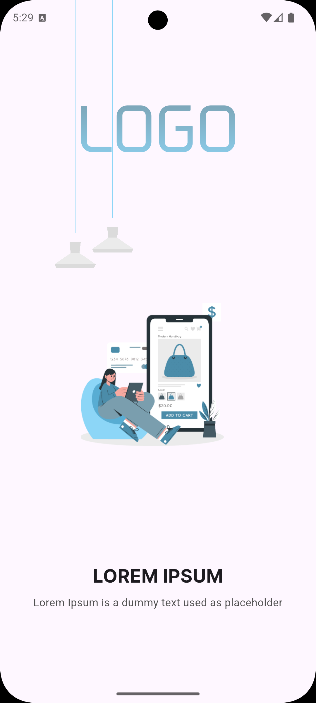
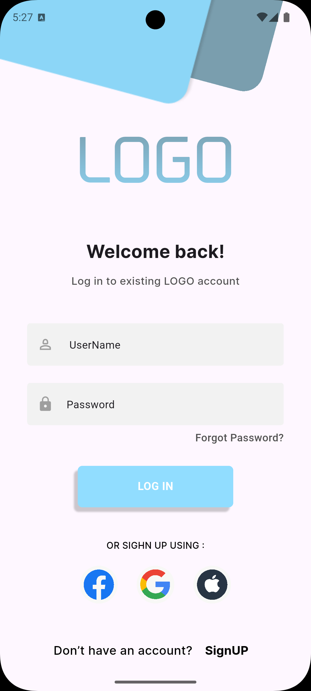
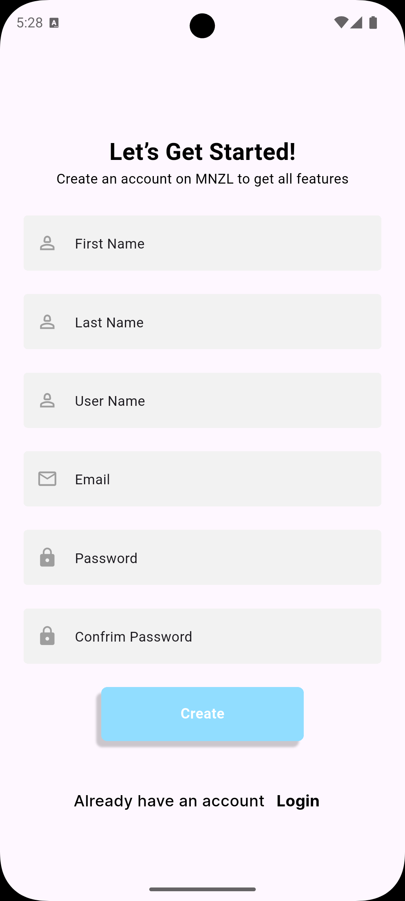

# 📱 MNZL Flutter UI – Authentication Screens

A clean and modern Flutter UI that includes Splash Screen, Login Screen, and Sign-Up Screen.  
All screens are fully responsive and easy to customize.

---

## 🖼️ Screenshots

### 🚀 Splash Screen


### 🔐 Login Screen


### 📝 Sign Up Screen


> Make sure to place these exact images in:  
> `assets/readme/`

---

## 🔧 Features

- Splash Screen  
- Login Screen (Email / Username / Password)  
- Sign Up Screen with 6 fields  
- Clean UI with soft colors  
- Google Fonts  
- Custom input fields  
- Social login icons (Facebook – Google – Apple)  
- Responsive layout for all devices  

---

## 📦 How to Run

Install packages:
flutter pub get

yaml
Copy code

Run the app:
flutter run

yaml
Copy code

---

## 🛠️ Dependencies
```yaml
dependencies:
  flutter:
    sdk: flutter
  google_fonts: ^6.1.0
📝 Assets Setup
1️⃣ Create this folder structure:
Copy code
assets/
 └── images/
 └── readme/
2️⃣ Put the README images here:
bash
Copy code
assets/readme/splashscreen.png
assets/readme/login.png
assets/readme/signup.png
3️⃣ Enable assets in pubspec.yaml:
yaml
Copy code
assets:
  - assets/images/
  - assets/readme/
